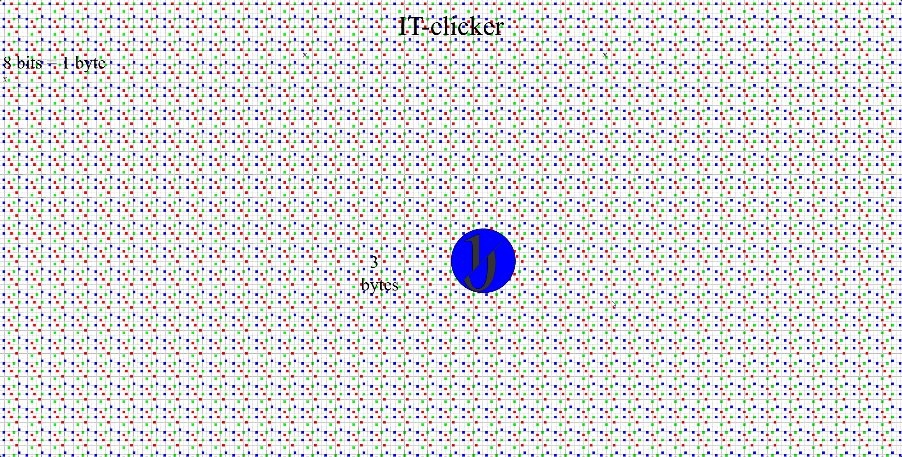

# IT-clicker
Учебная практика
 Задание 1 находится в файле "Описание Дипломного Проекта.DOCX"
 Задание 2 находится в папке "UML-диаграмма". Там есть и изображение диограммы и код для ей построения.
 Задание 3 - заготовка проекта находится в папке IT-Clicker. Так-же в корневой директории проекта есть скриншот прототипа реализованной HTML-страницы. Файл - "Скриншот_прототипа.png"

